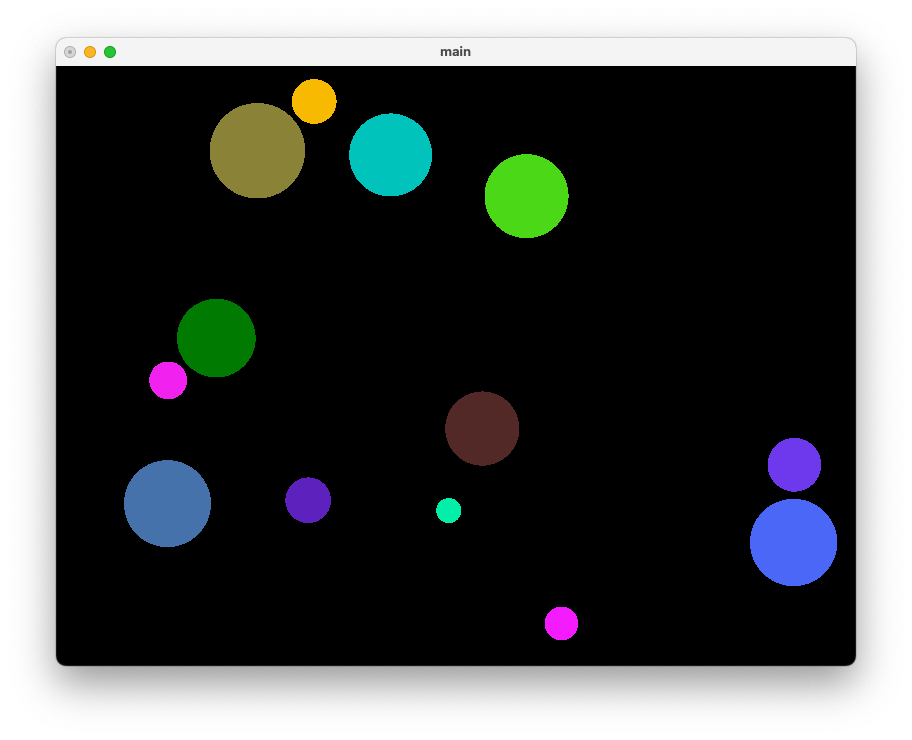
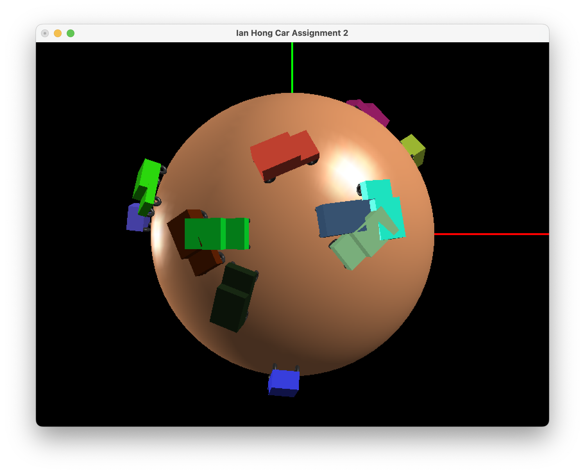
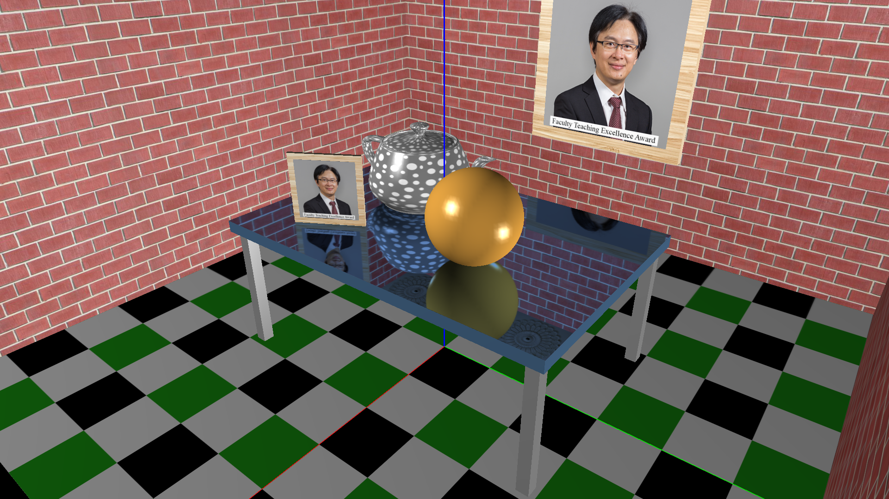

# opengl-cs3241
Assignments using OpenGL 2.1 for my CS3241 Computer Graphics module

Lab 1: Interaction. Click to spawn a ball that bounces off the screen

Lab 2: Camera rotation and clipping planes.

Lab 3: Texture mapping, made the table surface reflective, made the photo frame.

